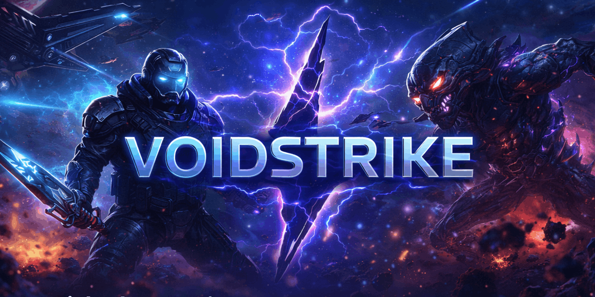

# VOIDSTRIKE 한글판

<div align="center">



**브라우저에서 동작하는, 브라우저 같지 않은 RTS**

[](https://www.typescriptlang.org/)
[](https://threejs.org/)
[](https://www.w3.org/TR/webgpu/)
[](https://opensource.org/licenses/MIT)

[라이브 데모](https://sigco3111.github.io/voidstrike/) · [빠른 시작](#빠른-시작) · [기술적 성취](#기술적-성취) · [한글화 노트](#한글화-노트)

</div>

---

## 📖 소개

**VOIDSTRIKE**는 브라우저에서 동작하는 사이파이 실시간 전략(RTS) 게임으로, 데스크톱 전략 게임의 무게감과 분위기를 그대로 구현하는 것을 목표로 합니다. 헤비한 분위기, 거대한 3D 전투, 강렬한 비주얼 아이덴티티, 그리고 단순한 웹 프로토타입이 아닌 진짜 시스템 깊이를 추구합니다.

원본 저장소: [braedonsaunders/voidstrike](https://github.com/braedonsaunders/voidstrike) — 본 저장소는 원본의 **한글화 포크(fork)**입니다. 모든 게임 로직과 자산은 원작자의 설계와 코드 그대로 유지됩니다.

---

## 🎮 게임 특징

- **워커 우선(Worker-first) RTS 런타임** — 권위 있는 ECS 시뮬레이션이 전용 게임 워커에서 실행되며, 길찾기·시야·AI 의사결정·오버레이 타이밍·카운트다운 로직이 추가 워커들로 분산됩니다.
- **백그라운드 안전 고정 스텝 시뮬레이션** — 워커 기반 고정 타임스텝 루프가 탭이 포커스를 잃어도 RTS 타이밍을 유지합니다.
- **결정론적 시뮬레이션 규율** — 양자화된 수치, 결정론적 정렬, 정수 제곱근, 멀티플레이어 안전 시스템 설계가 게임플레이 코드에 직접 통합되어 있습니다.
- **락스텝(Lockstep) 멀티플레이어 런타임** — 입력 배리어, 적응형 명령 지연, 하트비트 흐름 제어, 소유권 검증, 동기 요청, 명령 버퍼링이 라이브 런타임의 일부입니다.
- **틱 단위 비동기(Desync) 포렌식** — 매 몇 틱마다 상태 체크섬을 계산하고 Merkle-tree 발산 검색으로 불일치를 빠르게 좁힙니다.

---

## 🚀 빠른 시작

### 브라우저에서 바로 플레이

가장 간단한 방법: [라이브 데모](https://sigco3111.github.io/voidstrike/) 페이지를 브라우저에서 엽니다. 별도 설치나 다운로드가 필요 없습니다.

> **참고**: GitHub Pages는 커스텀 보안 헤더(COOP/COEP)를 지원하지 않으므로 SharedArrayBuffer를 사용할 수 없습니다. 이로 인해 Recast Navigation WASM의 멀티스레드 모드가 비활성화되고 JS 폴백 길찾기로 동작합니다. 게임 플레이 자체에는 영향이 없습니다.

### 로컬 실행

#### 사전 요구사항

- **Node.js 18+** (권장: 20.x LTS)
- **npm** (Node.js와 함께 설치됨)
- macOS / Windows / Linux 모두 지원

#### 단계별 안내

```bash
# 1) 저장소 클론
git clone https://github.com/sigco3111/voidstrike.git
cd voidstrike

# 2) 의존성 설치
npm install

# 3) 개발 서버 시작
npm run dev
# → http://localhost:3000 에서 자동 오픈
```

#### 원클릭 런처 (권장)

원본 저장소에서 제공하는 런처 스크립트가 가장 간단합니다:

- macOS: `launch/launch-voidstrike.command` 더블클릭
- Windows: `launch/launch-voidstrike.bat` 더블클릭
- Linux: `launch/launch-voidstrike.desktop` 더블클릭

런처는 자동으로 의존성 설치 → 빌드 → 프로덕션 서버 시작 → 브라우저 열기까지 수행합니다.

### 프로덕션 빌드

```bash
npm run build      # 정적 산출물 → out/ (GitHub Pages 배포용)
npm run start      # 프로덕션 서버 시작
npm run lint       # ESLint 검사
npm run type-check # TypeScript 타입 검사
npm test           # Vitest 단위 테스트
```

---

## 🛠️ 기술 스택

| 영역              | 기술                                  |
| ----------------- | ------------------------------------- |
| **프레임워크**    | Next.js 16 (App Router, Turbopack)    |
| **UI 라이브러리** | React 19                              |
| **언어**          | TypeScript 5 (strict)                 |
| **3D 렌더링**     | Three.js r182 + WebGPU (WebGL 폴백)   |
| **게임 엔진**     | Phaser 4 + ECS 패턴 + Web Workers     |
| **상태 관리**     | Zustand                               |
| **스타일링**      | Tailwind CSS 3                        |
| **P2P 네트워킹**  | WebRTC + Nostr (서버리스 시그널링)    |
| **길찾기**        | Recast Navigation WASM                |
| **물리/네트워크** | @recast-navigation/three, nostr-tools |
| **테스트**        | Vitest 4 + Testing Library            |
| **린팅**          | ESLint 9 + Prettier 3                 |

---

## ✨ 기술적 성취

### 🏗️ 아키텍처

- **워커 우선 런타임**: 권위 있는 ECS 시뮬레이션이 전용 게임 워커에서 실행되고, 길찾기·시야·AI·오버레이·카운트다운이 별도 워커로 분산됩니다.
- **결정론적 시뮬레이션**: 양자화된 수치, 결정론적 정렬, 정수 제곱근, 멀티플레이어 안전 시스템 설계가 코드 패스에 직접 통합되어 있습니다.
- **락스텝 멀티플레이어**: 입력 배리어, 적응형 명령 지연, 하트비트 흐름 제어, 소유권 검증, 동기 요청, 명령 버퍼링이 라이브 런타임의 일부입니다.

### 🎨 비주얼

- **WebGPU First**: WebGPU를 1급 렌더 백엔드로 지원하고 WebGL로 자동 폴백합니다.
- **셰이더 기반 VFX**: 파티클·셰이더 효과로 거대 3D 전투의 분위기를 살립니다.
- **Adaptive UI**: 70+ 유닛과 건물의 종류에 따라 동적으로 변하는 HUD와 컨텍스트 패널.

### 🌐 멀티플레이어

- **서버리스 P2P**: 자체 시그널링 서버 없이 Nostr 공개 relay를 통해 매치메이킹이 이루어집니다.
- **로비 시스템**: 4글자 코드로 손쉬운 로비 참가 + 공개 로비 브라우저.
- **WebRTC 데이터 채널**: 가벼운 락스텝 동기화 메시지 전달.

---

## 📂 프로젝트 구조

```
voidstrike/
├── src/
│   ├── app/                   # Next.js App Router 페이지
│   │   ├── page.tsx           # 메인 랜딩 (/)
│   │   ├── game/              # 인게임 라우트
│   │   │   ├── page.tsx       # 게임 진입
│   │   │   └── setup/         # 게임 설정 / 맵 에디터
│   │   └── layout.tsx
│   ├── components/            # React 컴포넌트
│   │   ├── game/              # 인게임 HUD·패널·컨트롤
│   │   ├── game-setup/        # 로비·맵 선택 UI
│   │   ├── lobby/             # 공개 로비 브라우저
│   │   ├── pwa/               # PWA 설치·서비스 워커
│   │   └── home/              # 메인 페이지 배경
│   ├── engine/                # 게임 엔진 (ECS·AI·물리·네트워크)
│   │   ├── network/           # WebRTC·Nostr P2P 레이어
│   │   ├── pathfinding/       # Recast Navigation 통합
│   │   └── ai/                # AI 의사결정 시스템
│   ├── workers/               # 워커 스레드 진입점
│   ├── store/                 # Zustand 상태 슬라이스
│   ├── phaser/                # Phaser 4 게임 씬
│   ├── rendering/             # WebGPU/WebGL 렌더링 파이프라인
│   ├── data/                  # 맵·유닛·건물 정적 데이터
│   ├── editor/                # 맵 에디터 시스템
│   └── types/                 # 공유 타입 정의
├── public/                    # 정적 자산 (오디오·텍스처·모델)
├── tests/                     # Vitest 단위 테스트
├── docs/                      # 문서·스크린샷
└── launch/                    # OS별 원클릭 런처
```

---

## 🌐 한글화 노트

본 저장소는 **원본 저장소(브라우저 RTS VoidStrike)의 한글화 포크**입니다. 모든 게임 로직·자산·원작자 크레딧은 원본 그대로 유지됩니다.

### 📌 한글화 방침

1. **UI 라벨·메뉴·버튼·상태 메시지**: 한글화 (예: `Settings` → `설정`, `Players` → `플레이어`)
2. **고유명사·게임 호칭**: 원문 영문 유지 (예: `Dominion` 진영, `WebGPU`)
3. **기술 용어·약어**: 영문 유지 (예: `FPS`, `LOD`, `ms`, `RTS`, `P2P`)
4. **CSS·JS 식별자**: 절대 변경 안 함 (식별자 침투 방지)
5. **자산 파일명·import 경로**: 절대 변경 안 함

### 🌐 GitHub Pages 배포 관련 안내

원본은 Vercel/자체 서버 배포를 전제로 한 Next.js 풀스택 앱입니다. 본 포크는 GitHub Pages에 정적 호스팅하기 위해 다음 변경을 적용했습니다:

| 항목                         | 원본                                    | 한글화 포크               |
| ---------------------------- | --------------------------------------- | ------------------------- |
| `next.config.js` `output`    | `undefined` (Vercel SSR)                | `'export'` (정적 export)  |
| `next.config.js` `basePath`  | `undefined`                             | `/voidstrike` (서브패스)  |
| `next.config.js` 커스텀 헤더 | COOP/COEP 강제 (SharedArrayBuffer 필수) | 제거 (Pages 미지원)       |
| Recast Navigation WASM       | 멀티스레드                              | 싱글스레드 폴백           |
| `/api/debug/pathfinding`     | 존재                                    | 제거 (정적 export 비호환) |

이로 인해 다음 기능이 동작하지 않습니다:

- ❌ **WASM 멀티스레드 길찾기** → JS 폴백 (성능 약간 저하)
- ❌ **Pathfinding 텔레메트리 디버그 API** → 디버그 전용이라 사용자 영향 없음
- ✅ 그 외 모든 게임 기능 (싱글·멀티플레이어·웹GPU·노스트 P2P) 정상 작동

### 🧪 검증된 동작

- ✅ 로컬 빌드 성공 (`npm run build`)
- ✅ 정적 export 성공 (`out/` 폴더 생성)
- ✅ 한글 UI 250+ 라벨 적용 (메뉴·HUD·로비·에디터)
- ✅ 식별자 침투 0건
- ✅ 라이브 데모: [sigco3111.github.io/voidstrike](https://sigco3111.github.io/voidstrike/)

---

## 🤝 기여 및 라이선스

이 저장소는 **MIT License** 하에 배포됩니다. 원본 저작권자는 [braedonsaunders](https://github.com/braedonsaunders)이며, 한글화 변경분만 sigco3111에 귀속됩니다.

원본에 기여하고 싶으시다면 → [braedonsaunders/voidstrike](https://github.com/braedonsaunders/voidstrike)

한글화 관련 이슈는 본 저장소의 Issue 탭에 등록해 주세요.

---

## 📜 크레딧

- **원작 및 게임 디자인**: [braedonsaunders](https://github.com/braedonsaunders)
- **AI 어시스턴트 기여**: [Claude (Anthropic)](https://www.anthropic.com/) — Claude가 작성한 코드 비율이 매우 높음
- **한글화**: sigco3111 (with Hermes Agent by Nous Research)

> 본 프로젝트는 MIT 라이선스 오픈소스이며, 상업적 이용이 가능합니다. 단, 원본 저장소의 저작권 표시와 라이선스 고지를 유지해야 합니다.
